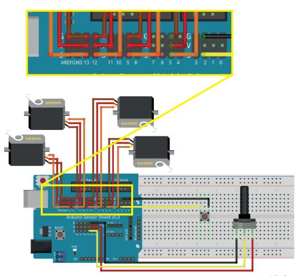

  

## Materiais: 

- 1 Placa Arduíno Uno R3
- 1 Cabo USB
- 1 Placa protoboard
- 1 Placa Sensor Shield V5.0
- 1 Potenciômetro
- 5 Jumpers macho-macho
- 5 Jumpers Fêmea-Fêmea
- 1 Push Button
- 4 Servos Motores
 
## Software:

- Arduino IDE

## Montagem do circuito:

